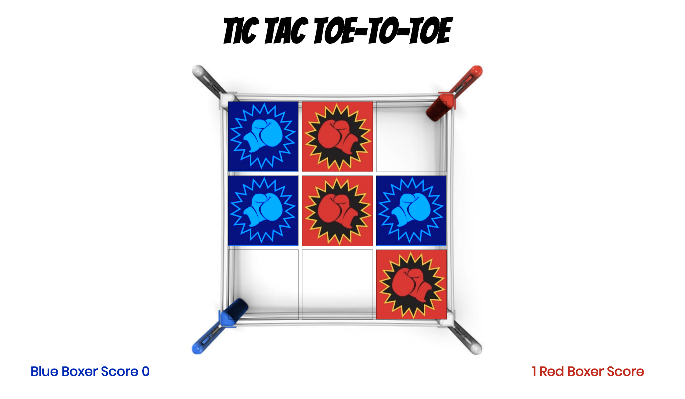

# Tic Tac Toe

### Play the game here: https://shahrene.github.io/Tic-Tac-Toe-to-Toe/

## Instructions

A boxing themed Tic Tac Toe styled game. Two boxers, red glove and blue glove take turns to throw hooks and jabs, ie. clicking the cells in a 3×3 grid. The boxer who succeeds in placing three of their coloured glove in a horizontal, vertical, or diagonal row wins the game. Blue starts the first game and then red starts the next one.

## Approach

I created the div grid and made these clickable. Then wrote a function with an event listener which would
alternatively populate the blue glove and red glove images into the div cell upon each click.
I added functions to hide the grid and show the start button. When clicked the button hides and the grid pops up.
I then added a function to check for wins, plays the cheering sound, shows a winning message. I wrote the clear board function which triggers after the winning message.

## Tech Used

I added animations to the grid which play when the button on the first page is clicked and I used some CSS styling on the divs to make appear as though they 'pop up' on hover.
I have two different sounds playing on alternate clicks of the div cells. Sounds play on click of the start button and when a game is won.
I used setTimeout() to delay the clear board function so the winner message plays for 3 seconds.

## Next Steps

- Make code DRY-er!
- I have made the board as responsive as possible but would like to add media queries so the game will look good on a smaller device.

